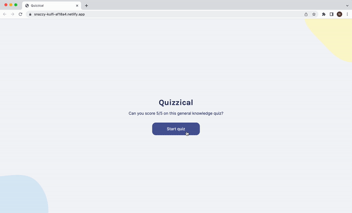
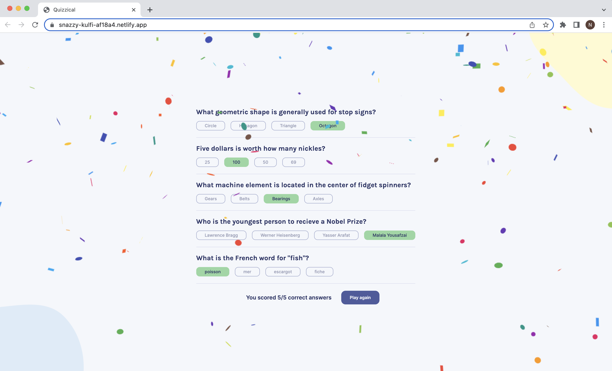

# Quizzical

Short quiz on general knowledge

## Features
The quiz starts when the "Start quiz" button is pressed. It contains of 5 questions that have 4 answers each. After selecting the answers and pressing the button "Check answers" the score is rendered and the correct answers will be shown. If the score is 5/5, there will be special confetti rendered on the screen. There is an option to play again after that and a new quiz will be rendered.

## Demo

Test it on Netlify: https://snazzy-kulfi-af18a4.netlify.app/

## Technologies
The project is built using:
* React
* JavaScript
* CSS
* HTML
* API

## Technical details
* Used API to get the quiz data.
* Used components for each section.
* Mapped over the data and used that to create multiple instances of the components.
* Used states, props and useEffect hook.
* Randomized the order of the answers.
* Conditionally rendered components.
* Conditionally added styles.
* Score is rendered after checking the answers.
* Special confetti if all 5 answers are correct.
* The answer buttons are disabled after checking the answers.
* Followed the design file on Figma.

## Project status
The project is complete.

## Acknowledgements
Quizzical is a solo project that was part of [the Frontend Developer Career Path at Scrimba](https://scrimba.com/learn/frontend).

## Contact
Created by [Natalia Davtyan](https://github.com/nataliadavtyan)